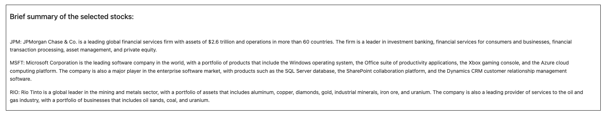
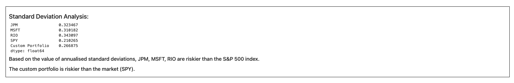

# Project_1
## Project Description
In the world of finance and investing, making informed decisions is crucial for achieving optimal returns and managing risks. Our project explores how Python code can be utilised to analyse and evaluate a portfolio consisting of multiple stocks, as well as conduct a Monte Carlo simulation to forecast future returns. By leveraging the power of data analysis and visualisation, we created a widget that helped us gain insights into the performance, risk, and potential outcomes of the investment portfolio.

## Research Questions to answer
* Daily and cumulative returns
* Risk analysis - Daily and annualised standard deviation
* Rolling standard deviation
* Correlation between stocks
* Beta values
* Sharpe ratios

## Datasets to be used
Alpaca API

## Rough breakdown of tasks
Isabel - Visualisation, Analysis, Functions

Natasha - Data cleaning, Presentation, Readme

Ram - Presentation, Readme

Yanbo - Visualisation, Analysis, Openai integration

## Findings and Summary
Importing libraries: We import the necessary libraries (matplotlib, numpy, seaborn, datetime) to
perform the analysis.

Loading environment variables: We load the environment variables from the .env file using the
load_dotenv function from the dotenv library.

Setting current amount of shares: We set the current amount of shares for five different stocks
in variables.

Setting API keys and creating API object: We configure the API keys and create an API object
for Alpaca. We store the Alpaca API key and secret in separate variables and utilise the REST
function from the alpaca_trade_api library to generate the API object.

We have created widgets for users to input a selection of up to 3 
stocks with their weights (adding up to 1). The user needs to further input their initial 
investment and click the button 'Submit'. 

A brief summary of each company is included in the beginning of the output, generated using openai.

Getting current closing prices: We calculate the current closing prices of the five stocks and
the S&P 500 from the Alpaca API using the get_bars function of the API object. We then
reorganise the DataFrame to separate the ticker data and concatenate them into a single
DataFrame, extracting the close prices for each stock into separate variables.

Getting historical data: We generate five years' worth of historical data for the same five stocks
and S&P 500 from the Alpaca API using the get_bars function of the API object. We reorganise
the DataFrame to separate the ticker data and extract the close prices for each stock into
separate variables. We then calculate the percentage change for each stock and drop the NaN
values. We concatenate the percentage change data into a single DataFrame.

Daily returns: We calculate the daily returns for all portfolios and create a box plot to show the 
distribution of daily returns across the selected portfolios.

Cumulative returns: We calculate and plot the cumulative returns over time, with colours 
indicating whether the returns were above or below the initial investment amount.

Daily standard deviations: We compute the daily standard deviations of all portfolios and print 
them, along with the rolling 21-day standard deviation for each portfolio plotted on a graph.

Annualised standard deviation: We calculate the annualised standard deviation using the daily
standard deviation and 252 trading days.

Correlation coefficients: We calculate the correlation coefficients between all portfolio pairs and
visualise them with a heat-map.

Beta values: We compute the beta values for the selected companies and display them in a bar
chart, showing how much the company's stock price moves relative to the broader market
represented by the SPY index.

Sharpe ratios: We compute the Sharpe ratios for each portfolio, indicating the risk-adjusted
return of each portfolio. We also compute annualised Sharpe ratios to provide a more
meaningful comparison of portfolios over time.

Scatter plot: Finally, we created a scatter plot to compare the daily standard 
deviation and Sharpe ratio of each portfolio, with the size of each point 
representing the average daily return for that portfolio. This plot can be used to 
compare the risk and return characteristics of each portfolio and identify the best 
investment options.

We then ran a 10 year Monte Carlo simulation on the historical data on these 
five stocks and created a Dataframe for the output. showing the combined 
returns over 10 years of all these stocks. 

Based on an assumed initial investment of $ 10,000, a progression of the cumulative 
returns of the portfolio was calculated. Following the summary statistics of this 
calculation, the folliowing result is printed: 'There is a 95% chance that an initial 
investment of $10,000 in the portfolio over the next year will end within in the range 
of $9445.81 and $80763.57.'

